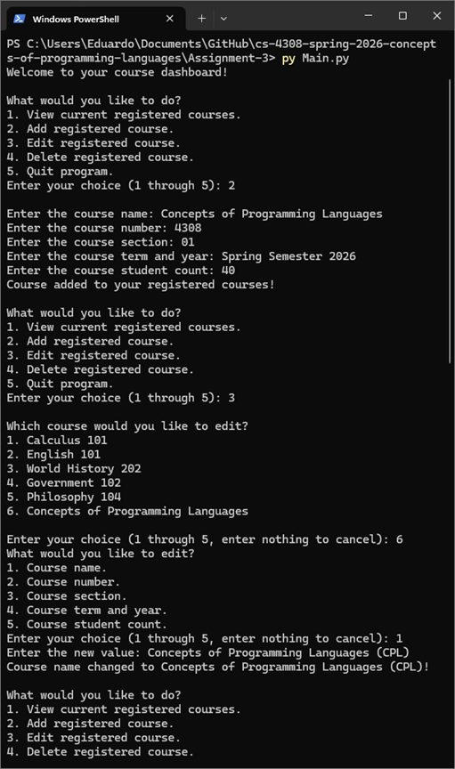

# Course Management System
Comes with five predefined courses in the courses list that you, the user, are already registered for. 
## CLI Execution
 1. Clone repository.
 2. From root directory for this particular project, simply run: 
`py Main.py`
## Screenshot

