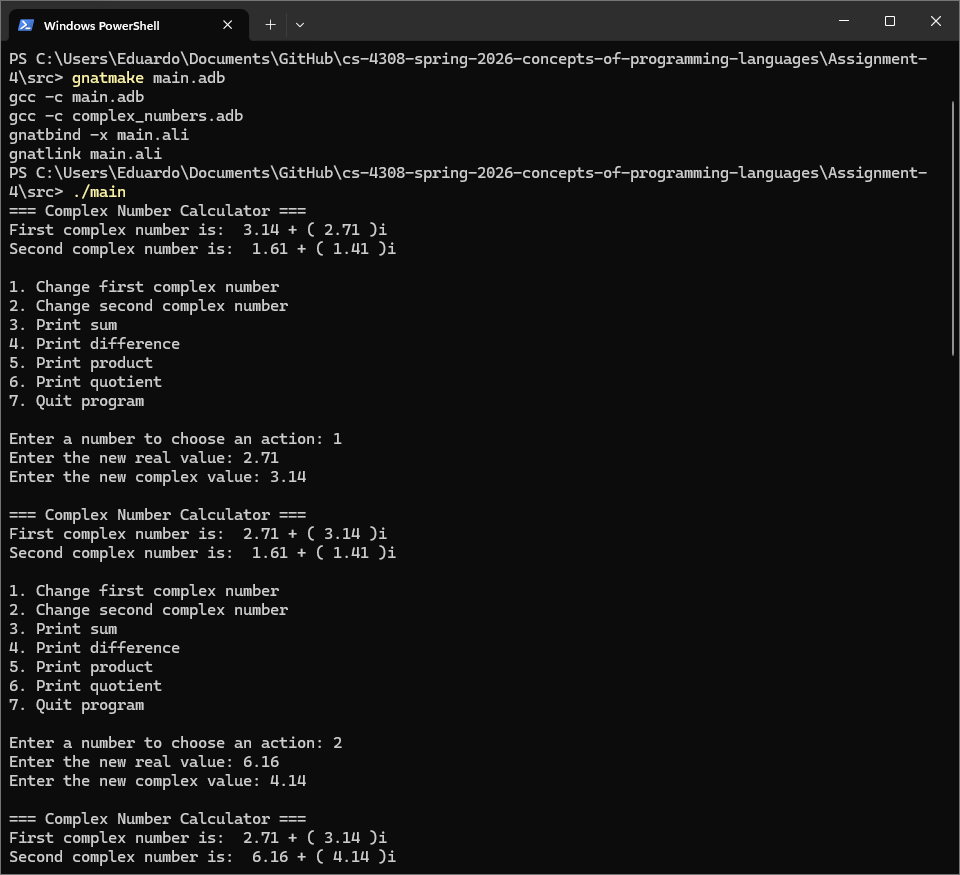
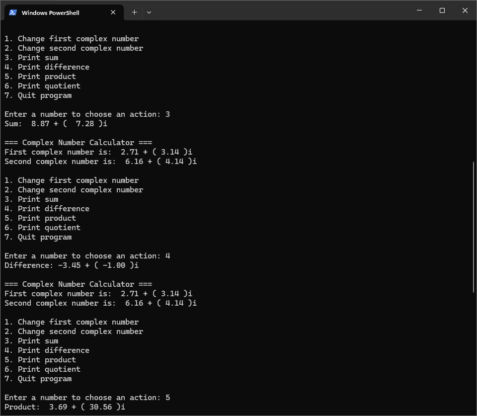
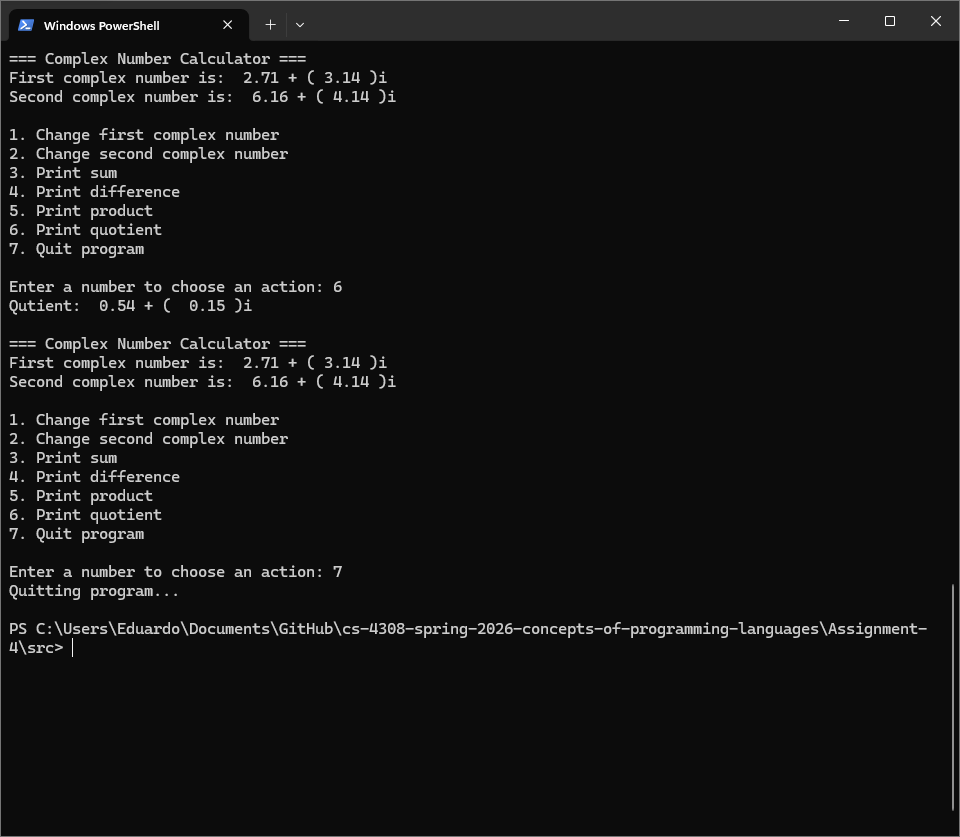

# Simple Complex Number Calculator
Allows users to define two complex numbers and calculate their sum, difference, product, and quotient. 
Comes with two complex numbers already set up for use. 
## CLI Execution
 1. Clone repository.
 2. From the root directory, compile the program with: 
`gnatmake main.adb`
 2. Then run it using: 
`./main`
## Screenshots

