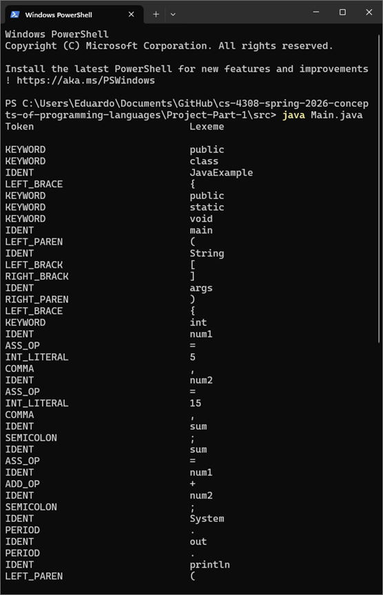

# Lexical Analyzer
Only analyzes the example java file provided with it; cannot analyze all operations or symbols. 
## CLI Execution
 1. Clone repository.
 2. From root directory for this particular project, simply run: 
`java Main.java`
## Screenshot

