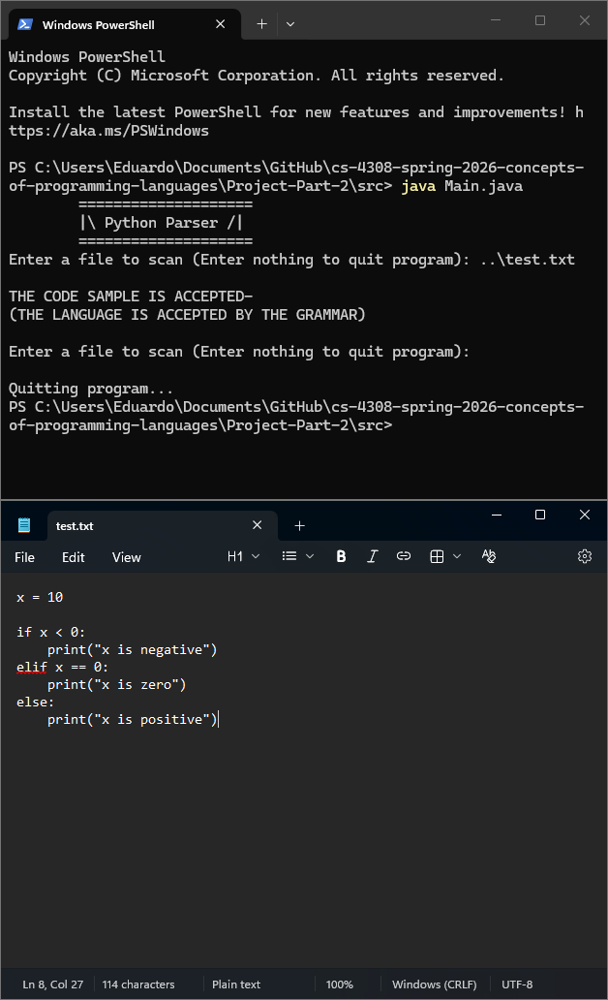
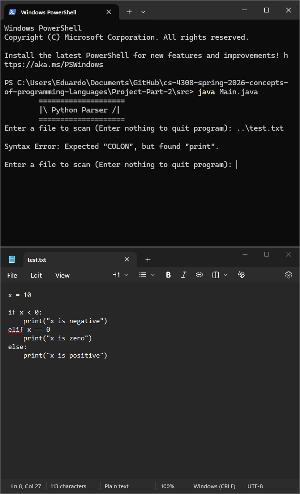

# Syntax Analyzer
Analyzes the syntax of Python programs using the following grammar.
```
if_stmt:
    | 'if' named_expression ':' block elif_stmt
    | 'if' named_expression ':' block [else_block]
elif_stmt:
    | 'elif' named_expression ':' block elif_stmt
    | 'elif' named_expression ':' block [else_block]
else_block:
    | 'else' ':' block
```
> [!WARNING]
> `named_expression` can only consist of two identities or numerical literals separated by a comparison operator. <br/>
> For example, the following are valid named_expressions: <br/>
> `x != 0`<br/>
> `12 > 0`<br/>
> `z == y`<br/>
> `6 <= w`

> [!WARNING]
> Nested if, elif, and else statements were not thoroughly tested or implemented, so your mileage may vary!
## CLI Execution
 1. Clone repository.
 2. Run the following command in root of the project:<br/>
`java Main.java`
 3. Analyze the test.txt file provided by entering the following file name when prompted:<br/>
`..\test.txt`
> [!NOTE]
> `..\test.txt` is a relative path from the root directory. It is recommended to use absolute paths to refer to files
> when using this program specifically.

## Screenshots
Correct code with no syntax issues: <br/>
 <br/><br/>
Incorrect code missing a colon by the elif statement: <br/>

